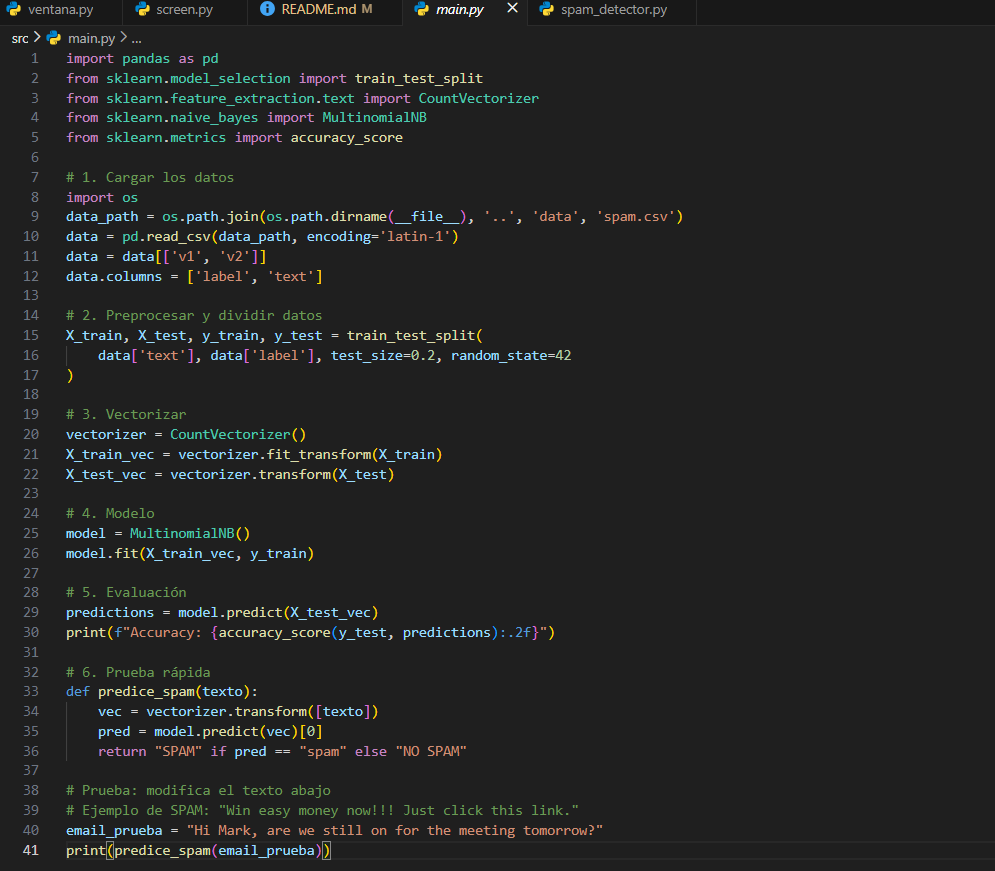
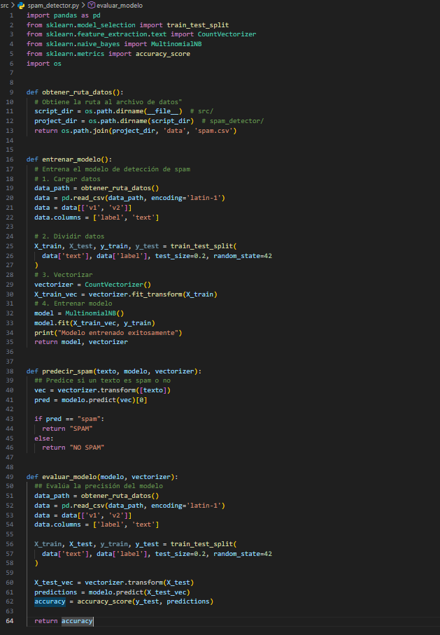
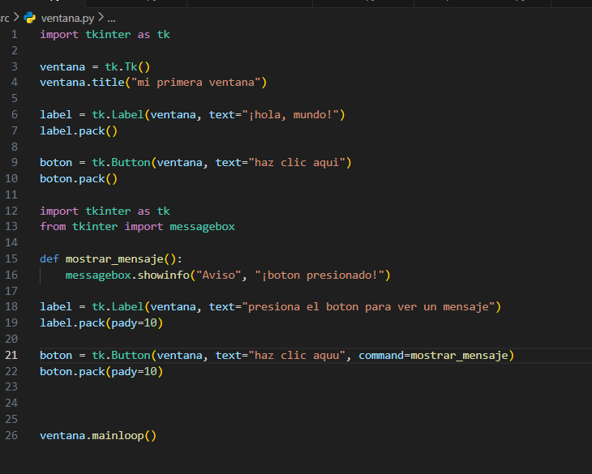
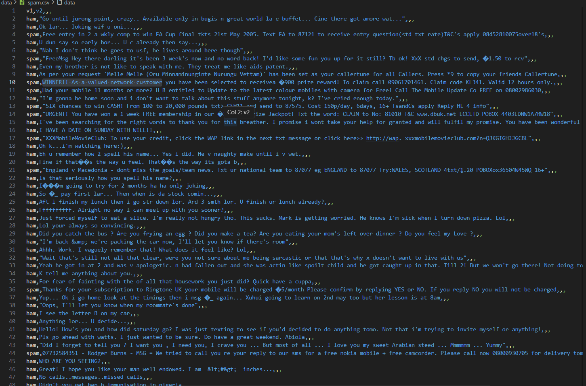
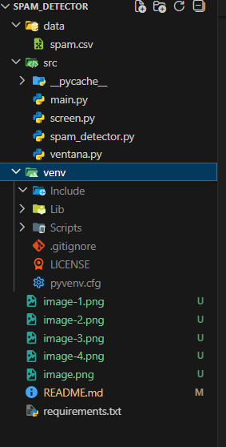
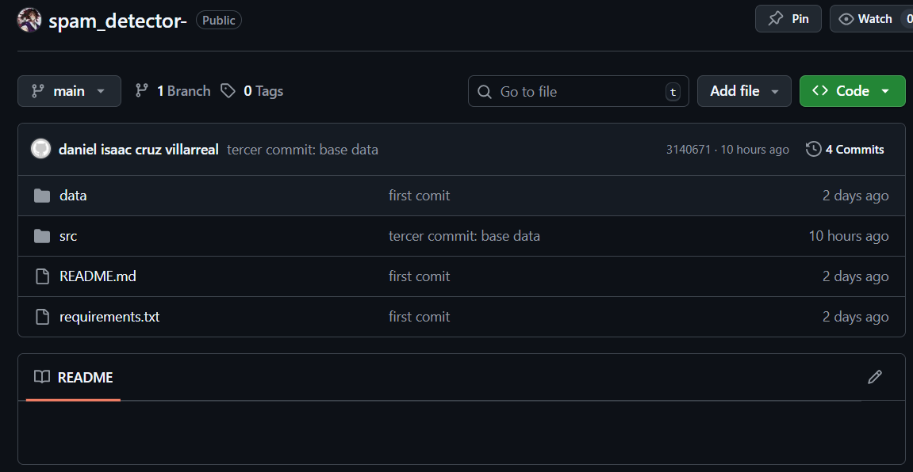

##¿que es y que hace la practica? 
bueno es un gran codigo de que puede detectar mensajes spam y no spam y incluso podemos agregar mas mensajes para el codigo

¿que aprendimos?
que se necesitan muchas bibliotecas para el desarrollo de este programa , necesitamos programas extras como "github y git " para que funcione y como tener una base de datos en linea para guardar nuestros trabajos asi tener las cosas ordenadas y aprendi a descargar mas extensiones utiles para facilitar mi aprendizaje 

¿como lo hicimos? 
bueno lo hicimos primero desde cmd fuimos a crear un entorno virtual , de alli brincamos al codigo para que funcione el github y git para todo saliera bien 

¿tecnologias-librerias utilizadas?
numpy,pandas,scikit-learn

¿trabajo futuro?
estar una buena empresa de programacion  y estar lo suficiente estable 

¿oportunidades de mejora?
si tengo quer mejorar mucho mi conocimiento de la programacion 

fotos de los codigos

todo esto esta en la carpeta de src:
 este main.py

 este es screen.py

  este es spam_detector.py

 este es ventana.py

este es mi  data 
 este es mi spam.csv

este es mi acomodo final

  
  este es mi github
  